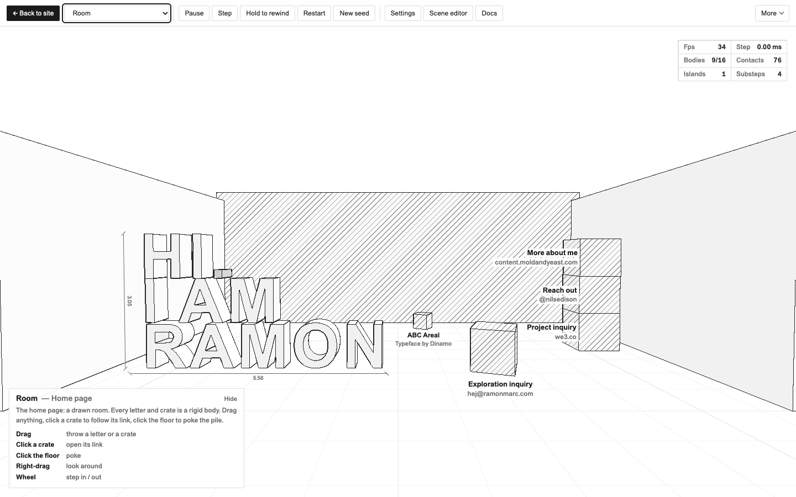
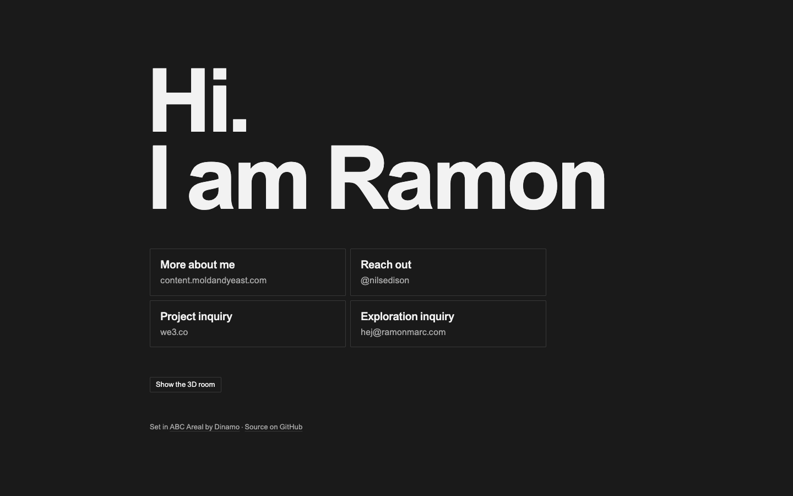

# moldandyeast.com

**One HTML file that is three things: a homepage, a drawn 3D room where every letter can be thrown, and a complete physics studio for making small games.** No framework, no build step for the content, no third-party requests. Fork it and make it yours.

**[moldandyeast.com](https://moldandyeast.com)** · by Ramon · more at [content.moldandyeast.com](https://content.moldandyeast.com) · [@nilsedison](https://twitter.com/nilsedison) on Twitter · set in [ABC Areal](https://abcdinamo.com/typefaces/areal) by [Dinamo](https://abcdinamo.com)


<table>
  <tr>
    <td width="50%"></td>
    <td width="30%"></td>
    <td width="20%"></td>
  </tr>
  <tr>
    <td>The studio</td>
    <td>Text page, dark mode</td>
    <td>Phone</td>
  </tr>
</table>

---

## Contents

- [The idea](#the-idea)
- [Using it](#using-it)
- [Write a game in YAML](#write-a-game-in-yaml)
- [Under the hood](#under-the-hood)
- [Type](#type)
- [Made for agents](#made-for-agents)
- [Fork it](#fork-it)
- [Deploy and verify](#deploy-and-verify)
- [Repository](#repository)
- [Credits and licence](#credits-and-licence)

## The idea

A personal site needs a name and a few links. This one keeps those as plain HTML, then adds the 3D room and the studio on top.

| Layer | What it is | Who gets it |
| --- | --- | --- |
| **`<main id="site">`** | A heading and four links. Semantic HTML with JSON-LD that works without JavaScript. | Everyone: screen readers, crawlers, agents, phones, `prefers-reduced-motion`, no WebGL 2 |
| **`<div id="app">`** | A drawn room. The letters and link crates are rigid bodies, built at load time from the HTML above, so the room can never disagree with the content. | Screens wider than 760px with a fine pointer and WebGL 2. "Text only" switches it off, and the choice is remembered |
| **The studio** | A 2D/3D physics engine with a sheet picker, rewind, settings, a YAML scene editor and its full documentation, all inside the same file. | Anyone who clicks **Studio** |

The rules that keep it that way:

- **The content lives in HTML.** Change a link in `<main>` and the room's crate changes with it.
- **One file.** `public/index.html` holds the CSS, the JavaScript engine and the YAML scenes. About 520 KB, or about 570 KB deployed with the font inlined.
- **Nothing third-party.** No CDNs, no analytics, no remote fonts. A Content-Security-Policy makes the browser enforce this, and a saved copy of the page runs offline.

## Using it

**The room.** Drag anything. Click a crate to follow its link. Click the floor to poke the pile. Right-drag to look around, scroll to step in or out. Hovering a link in the panel lights up its crate.

**The studio.** Press **Studio**, or open [`/#studio`](https://moldandyeast.com/#studio) on a wide screen. Esc goes back to the site.

| Key | Action | Key | Action |
| --- | --- | --- | --- |
| `P` | Pause | `,` | Settings (physics and style, live) |
| `.` | Step one physics frame | `;` | Scene editor (YAML) |
| hold `Backspace` | Rewind time | `/` | Documentation |
| `R` | Restart, same seed | `` ` `` | Debug view (contacts, bounds) |
| `N` | Restart, new seed | `T` | Cycle colour schemes |
| `M` | Sound | `Esc` | Back to the site |

**Sheets.** Each one is a small demo or game. On a wide screen, open one directly with its id as the URL anchor, e.g. [`/#pinball`](https://moldandyeast.com/#pinball).

| | 2D | | 3D |
| --- | --- | --- | --- |
| `A-01` | `#structures`: sandbox | `R-00` | `#room`: the home page |
| `A-02` | `#siege`: projectile puzzle | `B-01` | `#mass`: sandbox |
| `A-03` | `#rover`: driving on streaming terrain | `B-02` | `#demolition`: timed physics toy |
| `A-04` | `#stress2d`: benchmark | `B-03` | `#courier`: rolling platformer |
| `A-05` | `#pinball`: flippers, bumpers, plunger (YAML) | `B-04` | `#stress3d`: benchmark |
| | | `B-05` | `#bowling`: ten capsule pins (YAML) |
| | | `B-06` | `#expedition`: character, terrain, crystals (YAML) |
| | | `B-07` | `#quarry`: convex rocks in a crater (YAML) |

## Write a game in YAML

Scenes are plain text. This example from the built-in docs is a complete game:

```yaml
scene:
  id: knock          # unique id (also the URL #anchor)
  title: Knockdown
  dim: 2             # 2 or 3
  about: Topple ten of fifteen crates with one kick.
  controls: [[Space, kick]]
camera: {fit: [-10, -1, 10, 10]}          # 2D: frame a rectangle
bodies:
  - {type: static, shape: box, size: [20, 1], pos: [0, -0.5]}
  - {name: ball, shape: circle, r: 0.5, density: 4, pos: [-7, 1], style: {accent: true}}
  - {tag: crate, shape: box, size: [0.9, 0.9], pos: [2, 0.45],
     grid: {count: [3, 5], spacing: [1.5, 0.9]}}       # generator → 3 towers, 15 bodies
rules:
  - on: key Space
    do: [push ball [12, 6], sfx launch]          # velocity change in m/s; aim high to topple
  - on: when count('tag:crate', 'fallen') >= 10
    do: [win "Ten down" "in ${t} s"]
hud:
  FALLEN: =count('tag:crate', 'fallen')
```

Open the Scene editor (`;`), paste it, press **Run** (`Ctrl/⌘ Enter`), and **Save as sheet** to keep it in your browser. **Snapshot** turns any running world back into YAML. The language covers bodies, shapes, convex hulls, heightfield terrain, generators, joints, rules, expressions, HUD, annotations and a walking character. Anything it can't express can drop into JavaScript hooks. Press `/` in the studio for the full reference.

**Let a model write it.** Give an LLM the page (or just its Docs section) and ask for *"a YAML scene for &lt;your game idea&gt;"*. Paste the answer into the editor. Pinball, Bowling, Expedition and Quarry are written entirely in YAML and make good worked examples.

## Under the hood

The physics engine was written for this file, in plain JavaScript, with the same pipeline in 2D and 3D:

```
fat AABBs → sort & sweep → persistent contacts → packed solver → soft step ×4 → islands + sleep
```

It does convex hulls with GJK/EPA, heightfields, triangle meshes, capsules, joints with limits, ragdolls, sweeps and bullets, speculative contacts (no tunnelling at 150–200 m/s), bit-identical deterministic replay, and full-state snapshots, which is what makes rewind possible.

The studio's **Docs → Physics + benchmarks** page reports, measured in Node 22 on one machine:

- About 15 KB gzipped for 2D, 42 KB for 3D, 69 KB for both plus the math library.
- Faster than planck.js (Box2D port) and cannon-es in every scene, and level with Rapier (Rust/WebAssembly, a 3 MB binary) on 2D stacking.
- An automated suite of 63 tests (stacking, friction, restitution, mass ratios, joints, hulls, terrain, character, ragdolls, snapshots), all passing.

The design draws on [Jolt Physics](https://github.com/jrouwe/JoltPhysics/blob/master/Docs/Architecture.md) and Erin Catto's [Solver2D](https://box2d.org/posts/2024/02/solver2d/) and Box2D 3.0. The docs page lists the sources.

## Type

The site is set in **[ABC Areal](https://abcdinamo.com/typefaces/areal)**, Dinamo's free revival of Arial v2.82, originally made for [Are.na](https://www.are.na/editorial/introducing-areal-are-nas-new-typeface). The page started out in Arial, so this keeps its voice while fixing the details:

- **One scale.** 13 / 16 / 20px plus the display heading. There used to be fifteen sizes.
- **Real weights.** Regular for text, Areal's **Medium** for labels (Arial has no Medium, so browsers used to fake it), Bold only for the heading.
- **Letter-spacing tightens as size grows.** −0.035em on the heading, −0.01em on labels, slightly open at 13px.
- **Darkmode axis.** In dark mode the page sets Areal's `DRKM` axis, which corrects for light text glowing on dark backgrounds.

**The font is not in this repository, and can't be.** Areal is free, but [Dinamo's licence](https://abcdinamo.com/licenses) (§10) forbids putting fonts in public repositories, and forbids making letterform-shaped objects from them. So the build subsets your own copy and inlines it at deploy time, and the room's 3D letters stay Arial. Without the font, everything falls back to Arial and looks very nearly the same. [`fonts/README.md`](fonts/README.md) has the details.

## Made for agents

The page is meant to be read by language models and worked on by coding agents.

| | |
| --- | --- |
| [`/llms.txt`](https://moldandyeast.com/llms.txt) | A summary in the [llms.txt](https://llmstxt.org) format: who this is, contact links, the source, studio anchors |
| [`/index.md`](https://moldandyeast.com/index.md) | The page as Markdown, served as `text/markdown` |
| `/` | Semantic HTML plus JSON-LD `Person` data. It advertises both files above in `<link>` tags and in an HTTP `Link` header |
| [`/robots.txt`](https://moldandyeast.com/robots.txt) | Every crawler welcome, plus a sitemap |
| [`AGENTS.md`](AGENTS.md) | For coding agents: layout, invariants, licensing rules, deploy and verify (`CLAUDE.md` points here) |
| `npm run check` / `npm run verify` | Machine-checkable claims: JS checksum, nothing external, no font in git, live page byte-identical, every link returns 200 |

## Fork it

You need Node 20+ and a Cloudflare account. Hosting is an assets-only Worker, which is free and unmetered.

```sh
git clone https://github.com/moldandyeast/my-main-oct my-site && cd my-site
npm install
npm run dev                  # builds dist/, serves http://localhost:8787
```

Then make it yours:

1. **Content.** Edit the `<h1>` and the four links in `<main id="site">` (`public/index.html`). Keep `data-label` and `data-host` on each link: the crates read their labels from them. No JavaScript changes needed.
2. **Metadata.** In `<head>`: title, description, canonical URL, `rel="me"` links, JSON-LD.
3. **Colophon.** The line under the links. Its `data-crate` link becomes the small crate in the room, so point it at your own typeface, or remove the attribute to drop the crate.
4. **Agent files.** `public/llms.txt`, `index.md`, `robots.txt`, `sitemap.xml`.
5. **Type (optional).** Download Areal free from Dinamo, put `ABCArealVariable.woff2` in `fonts/`, and run `pip3 install fonttools brotli`. Skip this to stay on Arial.
6. **Domain.** In `wrangler.jsonc`, set `name`, and replace the route with `{ "pattern": "your.domain", "custom_domain": true }`. Wrangler creates the DNS record and certificate on the first deploy. (This repo uses a zone route only because the apex already had a DNS record. If yours does too, copy that.)

If you change the engine on purpose, refresh the checksum the checks rely on:

```sh
node -e 'const s=require("fs").readFileSync("public/index.html","utf8");const b=(s.match(/<script(?![^>]*application\/ld\+json)[^>]*>[\s\S]*?<\/script>/g)||[]).join("");console.log(require("crypto").createHash("sha256").update(b).digest("hex"))' > scripts/piece-js.sha256
```

## Deploy and verify

Deploys are manual: pushing publishes nothing, and there is no CI.

```sh
npx wrangler login           # once
npm run deploy               # runs scripts/build.mjs, then uploads dist/
npm run verify               # checks the live site against this repo
```

`verify` resolves the domain through 1.1.1.1 rather than your own resolver, which may still cache a "domain not found" from before the first deploy. It then checks that the live page is byte-identical to `dist/index.html`, that the JavaScript matches the checksum, that the agent files match, and that every colophon link returns 200.

## Repository

```
public/index.html        the site (source; falls back to Arial, no font inside)
public/llms.txt          for language models
public/index.md          the page as Markdown
public/robots.txt        crawler policy + sitemap pointer
public/sitemap.xml
public/_headers          CSP, Link header, content types (Cloudflare reads it; not served)
scripts/build.mjs        public/ → dist/, inlines the ABC Areal subset if fonts/ has it
scripts/verify.mjs       offline + live checks, no dependencies
scripts/piece-js.sha256  checksum of the page's JavaScript
fonts/README.md          how to get Areal, and why it is never committed
wrangler.jsonc           assets-only Worker serving dist/ on moldandyeast.com
AGENTS.md                instructions for coding agents
docs/                    screenshots for this README
```

`main` is kept nearly empty on purpose. The site lives on `my-main-oct-github-deploy`.

## Credits and licence

- **Code:** [MIT](LICENSE). Fork it, change it, ship it.
- **Words, name and contact details:** mine. Please swap them for your own.
- **Typeface:** [ABC Areal](https://abcdinamo.com/typefaces/areal) © Dinamo Typefaces GmbH, free under [their licence](https://abcdinamo.com/licenses), not included here. Thank you, Dinamo and Are.na.
- **Engine references:** Jolt Physics, Box2D and Solver2D, as listed in the studio docs.
