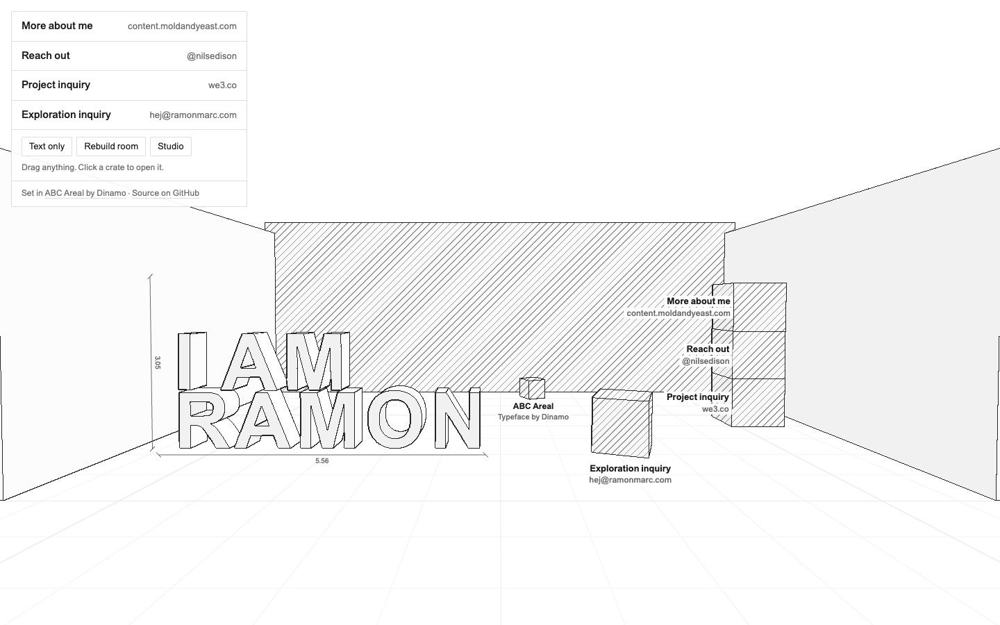
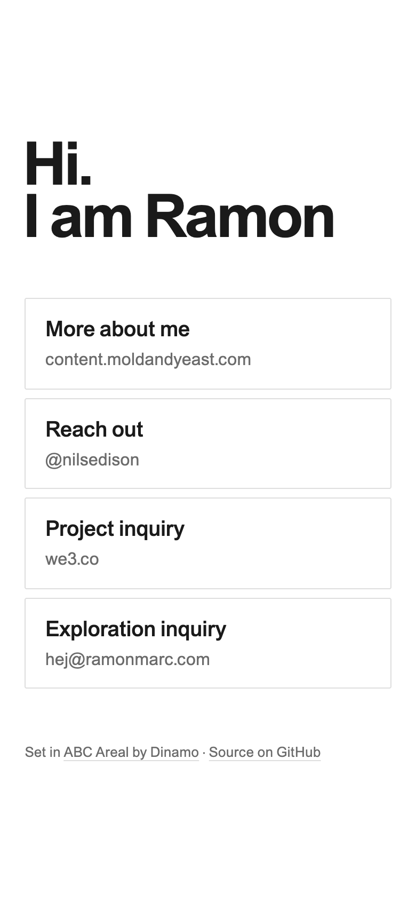

# moldandyeast.com

My personal site: a heading and four links, in one HTML file. On a wide screen the same page is also a drawn 3D room where every letter and crate is a rigid body you can throw around, and behind the **Studio** button there is a complete physics sandbox with a YAML scene language. Fork it and make it yours.

**Live:** https://moldandyeast.com · More at https://content.moldandyeast.com · follow [@nilsedison](https://twitter.com/nilsedison) on Twitter · [source on GitHub](https://github.com/moldandyeast/my-main-oct) · set in [ABC Areal](https://abcdinamo.com/typefaces/areal) by [Dinamo](https://abcdinamo.com), thank you

<p>
  
  
</p>

## What's in the page

`public/index.html` is the whole site, about 520 KB with nothing to build. It has three layers:

1. **`<main id="site">`, the content.** A heading and four links in plain HTML. It reads fine without JavaScript, in a screen reader, to a crawler and to an agent. It is what phones, touch tablets, `prefers-reduced-motion`, browsers without WebGL 2 and anyone who clicks "Text only" get.
2. **`<div id="app">`, the room.** Decorative and `aria-hidden`. It starts only on screens wider than 760px with a fine pointer and WebGL 2. It reads the heading and links out of the HTML above, so the letters and crates always match the real content.
3. **The studio.** A 2D/3D physics engine (rigid bodies, joints, ragdolls, terrain, rewind) with a settings panel, a YAML scene editor and its full documentation built into the file. Press `/` inside the studio to read it.

## Type

The page is set in **[ABC Areal](https://abcdinamo.com/typefaces/areal)**, Dinamo's free revival of Arial (made for [Are.na](https://www.are.na/editorial/introducing-areal-are-nas-new-typeface)). Since the original was all Arial, the switch is a refinement rather than a change of voice. There is one type scale: 13 / 16 / 20px plus the display heading. It uses real weights: Regular for text, Areal's **Medium** for labels (Arial has no Medium, so browsers used to fake it), and Bold only for the heading. Letter-spacing tightens as size grows (−0.035em on the heading, −0.01em on labels). In dark mode the page turns on Areal's `DRKM` axis, which corrects for light text glowing on dark backgrounds. A small crate at the back of the room says thank you to Dinamo; click it.

**Areal is not in this repo, and can't be.** Dinamo's licence forbids putting the fonts in public repositories, and forbids making letterform-shaped objects from them (so the room's 3D letters stay Arial). The build subsets and inlines your own copy at deploy time. See [`fonts/README.md`](fonts/README.md). Without it, everything falls back to Arial.

## No third-party requests

There are no CDNs, no analytics and no remote fonts. The deployed page inlines its font subset as base64, so you can save it to disk and it still runs offline. The live site also sends a Content-Security-Policy (`public/_headers`) so the browser enforces this.

## Fork it

You need Node 20+ and a Cloudflare account. Hosting is a static-assets-only Worker, which is free and unmetered.

```sh
git clone https://github.com/moldandyeast/my-main-oct my-site && cd my-site
npm install
npm run dev          # builds dist/, serves http://localhost:8787
```

For Areal, follow [`fonts/README.md`](fonts/README.md) (free download, `pip3 install fonttools brotli`). Otherwise you get Arial.

Then make it yours:

1. **Content.** Edit the `<h1>` and the four `<li>` links in `<main id="site">` in `public/index.html`. The room rebuilds itself from them, so you don't need to touch any JavaScript. Keep `data-label` and `data-host` on each link: they are what the crates show.
2. **Metadata.** In `<head>`, update the title, description, canonical URL, `rel="me"` links and the JSON-LD block.
3. **Colophon.** Change the `<p class="colophon">` line under the links (typeface credit + source link). The link with `data-crate` also becomes the small crate in the room.
4. **Agent files.** Rewrite `public/llms.txt`, `public/index.md`, `public/robots.txt` and `public/sitemap.xml` with your domain and links.
5. **Domain.** In `wrangler.jsonc`, set `name` to your project and replace the route with `{ "pattern": "your.domain", "custom_domain": true }`. The domain must be a zone on your Cloudflare account; Wrangler creates the DNS record and certificate on the first deploy. (This repo uses a zone route, `moldandyeast.com/*`, only because the apex already had a DNS record from an earlier site. Use the same if yours does.)
6. **Deploy.**

   ```sh
   npx wrangler login   # once
   npm run deploy
   npm run verify       # checks the live site against the files in this repo
   ```

If you change the JavaScript on purpose, refresh the checksum the checks use:

```sh
node -e 'const s=require("fs").readFileSync("public/index.html","utf8");const b=(s.match(/<script(?![^>]*application\/ld\+json)[^>]*>[\s\S]*?<\/script>/g)||[]).join("");console.log(require("crypto").createHash("sha256").update(b).digest("hex"))' > scripts/piece-js.sha256
```

## For agents

The site is meant to be easy to read and easy to work on for language models and coding agents.

| Path | What it is |
| --- | --- |
| [`/llms.txt`](https://moldandyeast.com/llms.txt) | Summary in the [llms.txt](https://llmstxt.org) format: who, contact links, where the source is, how to reach the studio |
| [`/index.md`](https://moldandyeast.com/index.md) | The page's content as Markdown, served as `text/markdown` |
| `/` | Plain semantic HTML with JSON-LD `Person` data. It advertises both files above in `<link>` tags and in an HTTP `Link` header |
| [`/robots.txt`](https://moldandyeast.com/robots.txt) | Allows every crawler and points to the sitemap |
| [`AGENTS.md`](AGENTS.md) | For coding agents working on this repo or a fork: layout, invariants, deploy, verification |
| `npm run check` / `npm run verify` | Offline checks (JS checksum, no external resources, no font in git), then live checks: DNS through 1.1.1.1, live page byte-identical to `dist/`, every colophon link returns 200 |

The studio has its own prompt loop too. Give a model the page, or just its Docs section, and ask for "a YAML scene for &lt;game idea&gt;". Paste the answer into the Scene editor and press Run. Pinball, Bowling, Expedition and Quarry are written entirely in YAML and make good worked examples. On a wide screen, opening `https://moldandyeast.com/#studio` goes straight into the studio, and `#pinball` (or any other sheet id) goes straight to that sheet.

## Files

```
public/index.html     the site (source; Arial fallback, no font inside)
public/llms.txt       for language models
public/index.md       Markdown version of the page
public/robots.txt     crawler policy + sitemap pointer
public/sitemap.xml
public/_headers       CSP, Link header and content types (Cloudflare reads this; it is not served)
scripts/build.mjs     public/ → dist/, inlines the ABC Areal subset if fonts/ has it
scripts/verify.mjs    offline and live checks, no dependencies
fonts/README.md       how to get Areal, and why the font is never committed
scripts/piece-js.sha256  checksum of the page's JavaScript
wrangler.jsonc        assets-only Worker serving dist/, routed on moldandyeast.com; runs the build first
AGENTS.md             instructions for coding agents (CLAUDE.md points here)
```

`main` is kept almost empty on purpose. The site lives on deploy branches such as `my-main-oct-github-deploy`.

## Licence

The code is [MIT](LICENSE): fork it, change it, ship it. The words, name and contact details are mine, so please swap them for your own. ABC Areal is © Dinamo Typefaces GmbH under [their licence](https://abcdinamo.com/licenses) and is not part of this repository.
